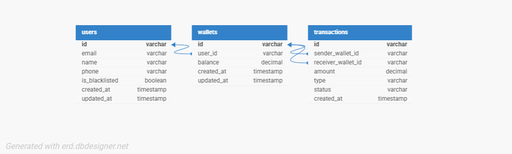

# Soledayo Lendsqr BE Test

A wallet service API built with NodeJS, TypeScript, KnexJS, and MySQL for the Lendsqr Backend Engineer Assessment.

---

## Table of Contents

- [Project Overview](#project-overview)
- [Tech Stack](#tech-stack)
- [Architecture & Design Decisions](#architecture--design-decisions)
- [E-R Diagram](#e-r-diagram)
- [API Endpoints](#api-endpoints)
- [Folder Structure](#folder-structure)
- [Getting Started](#getting-started)
- [Running Tests](#running-tests)
- [Deployment](#deployment)

---

## Project Overview

Demo Credit is a mobile lending app wallet service that allows borrowers to receive loans and make repayments. This MVP implements the following core features:

- A user can create an account
- A user can fund their wallet
- A user can transfer funds to another user's wallet
- A user can withdraw funds from their wallet
- A user with records on the Lendsqr Adjutor Karma blacklist cannot be onboarded

---

## Tech Stack

- **Runtime:** Node.js (LTS)
- **Language:** TypeScript
- **Framework:** Express.js
- **ORM:** KnexJS
- **Database:** MySQL
- **Authentication:** Faux JWT token-based auth
- **Testing:** Jest + Supertest
- **Deployment:** Railway

---

## Architecture & Design Decisions

### Layered Architecture
The project follows a clean layered architecture — routes → controllers → services → models. This separation ensures each layer has a single responsibility, making the codebase easy to maintain, test, and scale.

### Karma Blacklist Check
Before any user account is created, the Lendsqr Adjutor Karma API is called to verify the user is not blacklisted. If the user is found on the blacklist, registration is rejected immediately and no account or wallet is created.

### Transaction Scoping
All wallet operations (fund, transfer, withdraw) are wrapped in Knex database transactions. This ensures that if any step in the operation fails, the entire operation is rolled back, preventing partial updates or inconsistent wallet balances.

### Decimal Precision
Wallet balances are stored as `decimal(18,2)` in the database rather than float, to avoid floating point rounding errors when dealing with financial figures.

### Faux Authentication
As specified in the assessment, a full authentication system was not implemented. Instead, a simple JWT token is generated on login using the user's ID and email as the payload. All wallet endpoints require this token in the `Authorization` header as a Bearer token.

### Wallet Auto-Creation
When a user registers successfully, a wallet is automatically created and linked to their account in the same database transaction, ensuring every user always has exactly one wallet.

---

## E-R Diagram



### Database Tables

**users** — Stores user account information. Each user must pass the Karma blacklist check before being created.

**wallets** — Each user has exactly one wallet (1:1 relationship). Stores the current balance.

**transactions** — Records every wallet operation. `sender_wallet_id` is null for FUND operations. `receiver_wallet_id` is null for WITHDRAW operations.

---

## API Endpoints

### Auth
| Method | Endpoint | Description |
|--------|----------|-------------|
| POST | `/auth/login` | Login with email, returns JWT token |

### Users
| Method | Endpoint | Description |
|--------|----------|-------------|
| POST | `/users/register` | Register a new user (checks Karma blacklist) |

### Wallet
| Method | Endpoint | Description | Auth Required |
|--------|----------|-------------|---------------|
| GET | `/wallet` | Get wallet balance | Yes |
| POST | `/wallet/fund` | Fund wallet | Yes |
| POST | `/wallet/transfer` | Transfer funds to another user | Yes |
| POST | `/wallet/withdraw` | Withdraw funds from wallet | Yes |

### Sample Request & Response

**Register User**
```json
POST /users/register
{
  "name": "John Doe",
  "email": "john@example.com",
  "phone": "08012345678"
}
```

**Fund Wallet**
```json
POST /wallet/fund
Authorization: Bearer <token>
{
  "amount": 5000.00
}
```

**Transfer Funds**
```json
POST /wallet/transfer
Authorization: Bearer <token>
{
  "receiver_email": "jane@example.com",
  "amount": 2000.00
}
```

**Withdraw Funds**
```json
POST /wallet/withdraw
Authorization: Bearer <token>
{
  "amount": 1000.00
}
```

---

## Folder Structure

```
soledayo-lendsqr-be-test/
├── src/
│   ├── config/
│   │   ├── database.ts
│   │   └── env.ts
│   ├── controllers/
│   │   ├── auth.controller.ts
│   │   ├── user.controller.ts
│   │   └── wallet.controller.ts
│   ├── middlewares/
│   │   ├── auth.middleware.ts
│   │   └── error.middleware.ts
│   ├── migrations/
│   │   ├── 001_create_users.ts
│   │   ├── 002_create_wallets.ts
│   │   └── 003_create_transactions.ts
│   ├── models/
│   │   ├── user.model.ts
│   │   ├── wallet.model.ts
│   │   └── transaction.model.ts
│   ├── routes/
│   │   ├── auth.routes.ts
│   │   ├── user.routes.ts
│   │   └── wallet.routes.ts
│   ├── services/
│   │   ├── adjutor.service.ts
│   │   ├── auth.service.ts
│   │   ├── user.service.ts
│   │   └── wallet.service.ts
│   ├── tests/
│   │   ├── user.test.ts
│   │   └── wallet.test.ts
│   ├── types/
│   │   └── index.ts
│   └── app.ts
├── .env.example
├── .gitignore
├── knexfile.ts
├── package.json
├── tsconfig.json
└── README.md
```

---

## Getting Started

### Prerequisites
- Node.js (LTS)
- MySQL database

### Installation

```bash
# Clone the repository
git clone https://github.com/CHToken/soledayo-lendsqr-be-test.git
cd soledayo-lendsqr-be-test

# Install dependencies
npm install

# Copy environment variables
cp .env.example .env
# Fill in your database credentials and Adjutor API key in .env

# Run database migrations
npm run migrate

# Start the development server
npm run dev
```

### Environment Variables

```env
PORT=3000
DB_HOST=localhost
DB_PORT=3306
DB_USER=root
DB_PASSWORD=yourpassword
DB_NAME=lendsqr_wallet
JWT_SECRET=yourjwtsecret
ADJUTOR_API_KEY=youradjutorapikey
```

---

## Running Tests

```bash
npm run test
```

Tests cover both positive and negative scenarios for user registration and all wallet operations.

---

## Deployment

The API is deployed and accessible at:

**https://soledayo-lendsqr-be-test.up.railway.app**

---

## Author

**Soledayo Fadakinte Temitope**
- GitHub: [CHToken](https://github.com/CHToken)
- Email: fadakintesoledayo@gmail.com
- LinkedIn: [soledayo-fadakinte](https://www.linkedin.com/in/soledayo-fadakinte/)